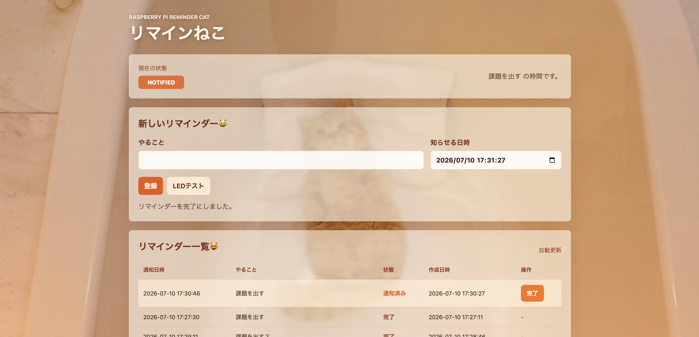

# リマインねこ

時間になったら LED で教えてくれる、ねこです。😺

## 環境構築

1. このリポジトリをクローンする

```bash
git clone <リポジトリのURL>
cd web-server
```

2. Python 仮想環境を作成し、必要なライブラリをインストールする

```bash
make setup
```

3. Webサーバを起動する

```bash
make run
```

起動できたら、同じネットワーク上のブラウザから、

```text
http://<Raspberry Pi のIPアドレス>:5000
```

にアクセスする。

IPアドレスは、Raspberry Pi 側で次のコマンドを実行する。

```bash
hostname -I
```

## 使い方



1. 「やること」に、リマインド内容を入力する
2. 「知らせる日時」に、リマインド日時を入力する
3. 「登録」を押す
4. 指定した時間になると、LEDが点滅する
5. 受け取ったら、「完了」を押す

## 技術スタック

| 機能           | 使用技術                | 役割                                         |
| -------------- | ----------------------- | -------------------------------------------- |
| フロントエンド | HTML / CSS / JavaScript | 画面本体                                     |
| バックエンド   | Python                  | リマインダーの登録、保存、時刻判定           |
| Webサーバ      | Flask                   | 画面表示とAPIの提供                          |
| LED制御        | gpiozero                | Raspberry Pi のGPIOに接続したLEDを点滅させる |

- DB は使わず、JSON ファイルに保存している。

- 環境構築には Makefile を用いた。

### API 一覧

- `GET /` リマインダー画面を表示する

- `GET /api/reminders` リマインダー一覧を取得する

- `POST /api/reminders` リマインダーを登録する

- `POST /api/reminders/<reminder_id>/complete` リマインダーを「完了」の状態にする

- `POST /api/reminders/<reminder_id>/cancel` リマインダーを取り消す

- `POST /api/test-led` LED点灯テスト用
